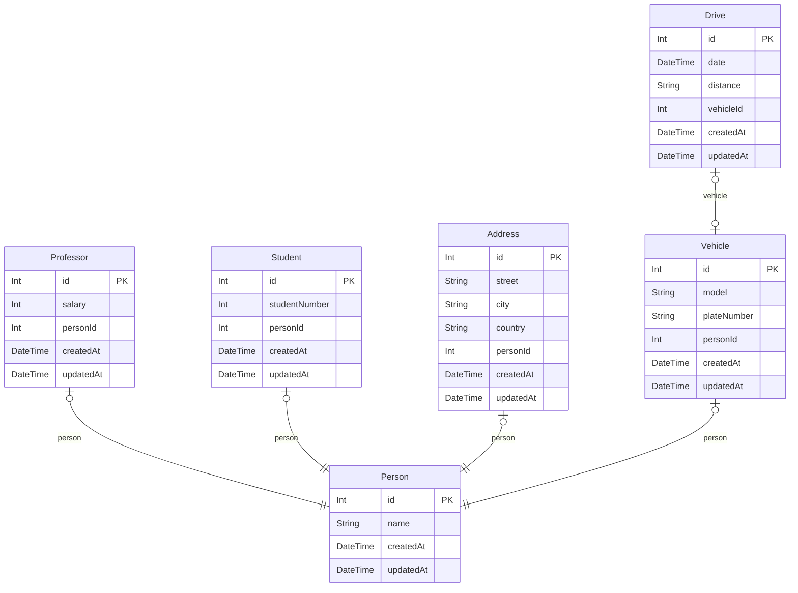

```mermaid
erDiagram

  Person {
    Int id PK 
    String name  
    DateTime createdAt  
    DateTime updatedAt  
    }
  

  Professor {
    Int id PK 
    Int salary  
    Int personId  
    DateTime createdAt  
    DateTime updatedAt  
    }
  

  Student {
    Int id PK 
    Int studentNumber  
    Int personId  
    DateTime createdAt  
    DateTime updatedAt  
    }
  

  Address {
    Int id PK 
    String street  
    String city  
    String country  
    Int personId  
    DateTime createdAt  
    DateTime updatedAt  
    }
  

  Vehicle {
    Int id PK 
    String model  
    String plateNumber  
    Int personId  
    DateTime createdAt  
    DateTime updatedAt  
    }
  

  Drive {
    Int id PK 
    DateTime date  
    String distance  
    Int vehicleId  
    DateTime createdAt  
    DateTime updatedAt  
    }
  
    Professor o|--|| Person : "person"
    Student o|--|| Person : "person"
    Address o|--|| Person : "person"
    Vehicle o|--|| Person : "person"
    Drive o|--|o Vehicle : "vehicle"
```
